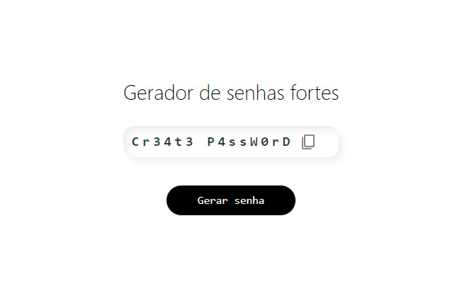

 <h1>Gerador de senhas fortes</h1>
 
Website que cria senhas fortes usando javascript para embaralhar os caracteres aleatoriamente  
  <a href='https://m1guelzinn.github.io/Creating-a-strong-password/'>Clique aqui para ver a página online</a>

 
  

   <h2> 🛠 Tecnologias usadas<h2>

   &nbsp;
   &nbsp;
   &nbsp;

 

    
 🚀 

